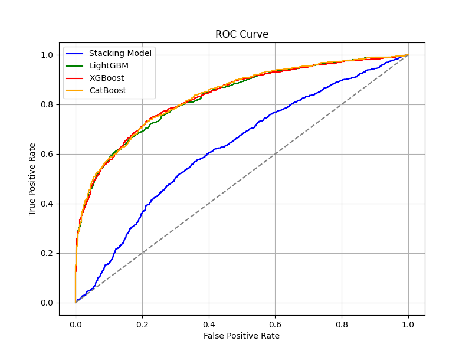

# 💳 채무 불이행 여부 예측: 불이행의 징후를 찾아라!

### 📚 배경
채무 불이행은 금융 기관과 개인 모두에게 큰 영향을 미치며, 경제 시스템에 부담 UP
 효과적으로 채무 불이행 여부를 예측할 수 있는 기술은 금융 안정성을 높이고, 금융 서비스 제공자와 고객 간의 신뢰를 강화하는 데 큰 기여하기

### 🧑‍💻 주제
채무 불이행 가능성을 예측하는 AI 알고리즘 개발 

### 📊 데이터 특성
- 19개 독립변수 (수치형 15개, 범주형 4개)
- 채무 불이행 여부: 0(정상 상환), 1(채무 불이행)
- 클래스 불균형: 1:1.8 → 소수 클래스(불이행) 예측 정확도가 핵심

### 데이터 전처리 전략
#### 1. 데이터 정제  
| 단계 | 방법 | 근거 |  
|------|------|------|  
| UID 제거 | UID 컬럼 삭제 | 고유 식별자는 모델 예측력에 기여하지 않으며 과적합 유발 가능성 |  
| 이상치 처리 | IQR 기반 Winsorizing 대신 중앙값 대체 선택 | 트리 기반 모델의 이상치 Robustness 특성 활용 |  

#### 2. 파생변수 공학  
| 파생변수 | 금융적 해석 | 수학적 표현 | 예상 영향력 |  
|----------|------------|--------------|--------------|  
| 신용 점수 대비 부채 비율 | 신용등급 대비 실제 부담률 | `부채 비율 / 신용 점수` | 음의 상관관계 예상 |  
| 연체 리스크 지표 | 과거 이력 기반 미래 위험 예측 | `발생 횟수 × 경과 개월` | 양의 상관관계 예상 |  
| 월 소득 대비 부채 비율 | 현금흐름 안정성 평가 | `월 상환액 / (연소득 / 12)` | 임계값 초과 시 위험 증가 |  
#### 3. 결측치 처리 체계
수치형 변수:
- 중앙값 대체 이유:
    - 로버스트 통계량으로 극단값 영향 최소화
    - `신용 점수` 등의 변수에서 Skewness 관찰
범주형 변수:
- 'Unknown'처리 장점:
    - 신규 범주 출현시 대응 가능
    - 모델 범주 고정으로 안전성 확보 
#### 4. 인코딩 
| 방법 | 장점 | 단점 | 선택이유 |
|-----|------------|--------------|--------------| 
||||

### 📚 분석 및 시각화

    
### ⚒️ Libraries & Tools

 

### 🔧 트러블슈팅 회고
#### 1. 

#### 2. 

#### 3. 

