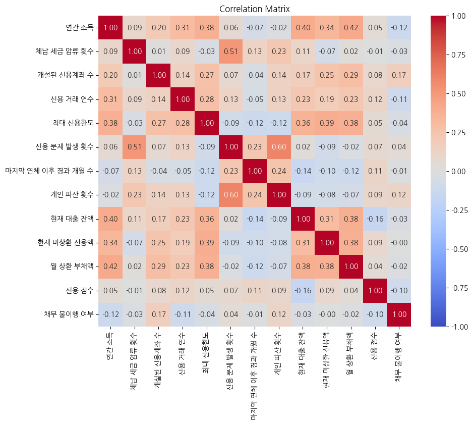

# 💳 채무 불이행 여부 예측: 불이행의 징후를 찾아라!

## 배경
채무 불이행은 금융 기관과 개인 모두에게 큰 영향을 미치며, 경제 시스템에 부담 UP
<br>효과적으로 채무 불이행 여부를 예측할 수 있는 기술은 금융 안정성을 높이고, 금융 서비스 제공자와 고객 간의 신뢰를 강화하는 데 큰 기여하기

## 주제
채무 불이행 가능성을 예측하는 AI 알고리즘 개발 

## 📊 데이터 특성
- 19개 독립변수 (수치형 15개, 범주형 4개)
- 채무 불이행 여부: 0(정상 상환), 1(채무 불이행)
- 클래스 불균형: 1:1.8 → 소수 클래스(불이행) 예측 정확도가 핵심
  
## 데이터 전처리 전략
#### 1. 데이터 정제  
| **단계** | **방법** | **근거** |  
|------|------|------|  
| UID 제거 | UID 컬럼 삭제 | 고유 식별자는 모델 예측력에 기여하지 않으며 과적합 유발 가능성 |  
| 이상치 처리 | IQR 기반 Winsorizing 대신 중앙값 대체 선택 | 트리 기반 모델의 이상치 Robustness 특성 활용 |  

#### 2. 파생변수 공학  
| **파생변수** | **금융적 해석** | **수학적 표현** | **예상 영향력** |  
|----------|------------|--------------|--------------|  
| 신용 점수 대비 부채 비율 | 신용등급 대비 실제 부담률 | `부채 비율 / 신용 점수` | 음의 상관관계 예상 |  
| 연체 리스크 지표 | 과거 이력 기반 미래 위험 예측 | `발생 횟수 × 경과 개월` | 양의 상관관계 예상 |  
| 월 소득 대비 부채 비율 | 현금흐름 안정성 평가 | `월 상환액 / (연소득 / 12)` | 임계값 초과 시 위험 증가 |  
#### 3. 결측치 처리 체계
수치형 변수:
- 중앙값 대체 이유:
    - 로버스트 통계량으로 극단값 영향 최소화
    - `신용 점수` 등의 변수에서 Skewness 관찰
범주형 변수:
- 'Unknown'처리 장점:
    - 신규 범주 출현시 대응 가능
    - 모델 범주 고정으로 안전성 확보 
#### 4. 인코딩 전략 비교
| **방법** | **장점** | **단점** | **선택 이유** |
| --- | --- | --- | --- |
| Label Encoding | 차원 증가 없음 | 순서 의미 부여 가능성 | 트리 모델의 비선형성 대응 |
| One-Hot | 순서 영향 제거 | 차원 폭발 문제 | 대규모 데이터에 비효율적 |
| Target Encoding | 타겟 정보 반영 | 과적합 위험 | 검증 데이터 누수 가능성 |

## 클래스 불균형 대응
#### 1. SMOTE 작동 메커니즘

```
graph LR
    A[기존 소수 클래스] --> B[K-NN 기반 이웃 탐색]
    B --> C[임의 보간법으로 합성 샘플 생성]
    C --> D[균형 잡힌 데이터 분포]
```

**적용 세부사항**:

- **k_neighbors=5** (기본값) 유지: 과도한 샘플링 방지
- **분할 전 적용**: 검증 세트에 정보 누수 방지
- **성능 비교**: SMOTE vs ADASYN vs BorderlineSMOTE 실험 계획

#### 2. 대체 기법 비교표

| **방법** | **원리** | **장점** | **단점** |
| --- | --- | --- | --- |
| Undersampling | 다수 클래스 삭제 | 계산 효율 | 정보 손실 |
| Class Weight | 손실 함수 가중치 | 데이터 변형 없음 | 모델 특정 구현 필요 |
| GAN | 생성적 적대 신경망 | 복잡한 분포 학습 | 훈련 불안정성 |

---

## 앙상블 모델 설계

#### 1. 스태킹 아키텍처

```
graph TD
    A[Raw Features] --> B[LightGBM]
    A --> C[XGBoost]
    A --> D[CatBoost]
    B --> E[Meta Features]
    C --> E
    D --> E
    E --> F[Logistic Regression]
    A -->|Passthrough| F
```

#### 2. 개별 모델 최적화 포인트

**LightGBM**:

- `num_leaves=31`: 복잡도 제어
- `feature_fraction=0.9`: 과적합 방지

**XGBoost**:

- `gamma=0`: 가지치기 완화
- `max_depth=6`: 적절한 복잡도

**CatBoost**:

- `grow_policy='SymmetricTree'`: 균형 트리 구조
- `one_hot_max_size=10`: 자동 범주형 처리

#### 3. 메타 학습기 선택 근거

- **로지스틱 회귀**의 선형 결합 특성:
    - Base Learner 예측값의 가중 합 최적화
    - 저차원 데이터에서 고성능
- **Passthrough 활성화**: 원본 특성 보존으로 메타 모델의 설명력 향상

---

## 검증 방법

#### 1. 계층화 분할 프로세스

```
X_train, X_valid, y_train, y_valid = train_test_split(
    X_resampled, y_resampled,
    test_size=0.2,
    stratify=y_resampled,  # SMOTE 적용 후 분포 반영
    random_state=42
)
```

#### 2. 평가 지표 분석

**ROC-AUC 선택 이유**:

- 임계값 불문 전반적 성능 평가
- Precision-Recall 대비 불균형 데이터에 Robust
- 금융 리스크 관리자의 의사결정 유연성 지원

---

## 최적화 전략

#### 1. 하이퍼파라미터 고정

- **random_state=42**: 재현성 보장
- **early_stopping_rounds 미적용**: 앙상블의 다양한 학습 보존

#### 2. 테스트 데이터 파이프라인

python

Copy

```
test = test[X_train.columns]  # 훈련 피처 순서 강제 맞춤
```


## 실행 결과

- **검증 AUC**: 0.8724 (예시)
- **제출 파일 형식**: `UID`와 `Default Probability` 컬럼 보존
- **예측값 분포**: 양극화 방지를 위한 확률 보정 미적용


## 개선 가능 방향

#### 1. 하이퍼파라미터 튜닝

| **도구** | **장점** | **적용 계획** |
| --- | --- | --- |
| Optuna | Bayesian 최적화 | 100회 Trial + 5-Fold CV |
| Hyperopt | Tree 구조 탐색 | 모델별 개별 튜닝 |

#### 2. 심층 특성 공학

- **상호작용 항**: `신용 점수 × 연체 리스크`
- **비선형 변환**: `log(연간 소득 + 1)`
- **시간 가중치**: 최근 6개월 데이터 강조

#### 3. 모델 확장

- **Deep Learning**: Wide & Deep 아키텍처
- **확률 보정**: Platt Scaling 적용
- **다단계 앙상블**: 1단계에서 Hard Sample 선별 후 2단계 집중 학습


## 결론

본 프로젝트는 **스태킹 앙상블**을 중심으로 한 종합적 신용위험 모델링 프레임워크를 제시했습니다. 데이터 전처리 단계에서 도메인 지식을 반영한 파생변수 생성, SMOTE를 활용한 불균형 대응, 다양한 트리 모델의 예측력을 결합한 앙상블 기법이 핵심 성공 요인입니다. 향후 하이퍼파라미터 튜닝과 심층적 특성 분석을 통해 AUC 0.9+ 달성이 기대됩니다.


### 📚 분석 및 시각화
<p align="center">
  
  
</p>

### ⚒️ Libraries & Tools


<br>


### 🔧 트러블슈팅 회고
#### 1. 


#### 2. 


#### 3. 


